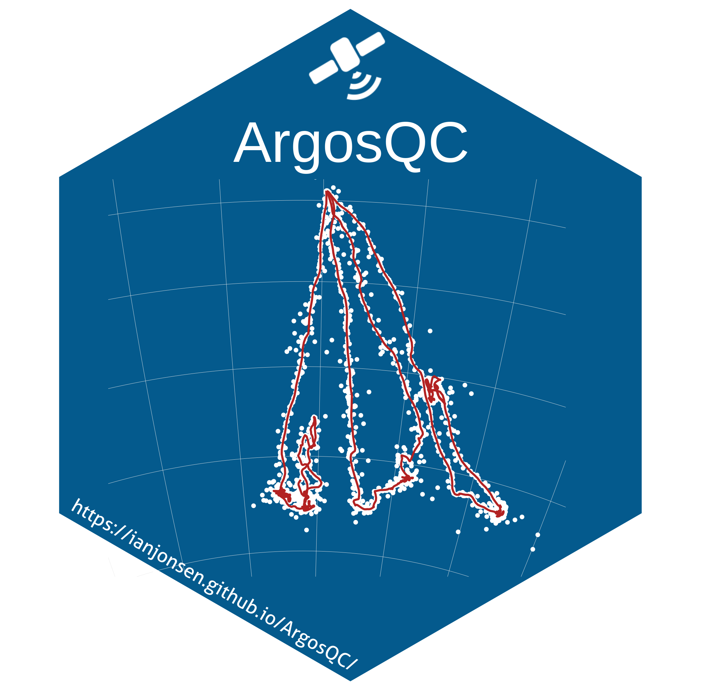
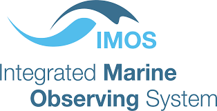
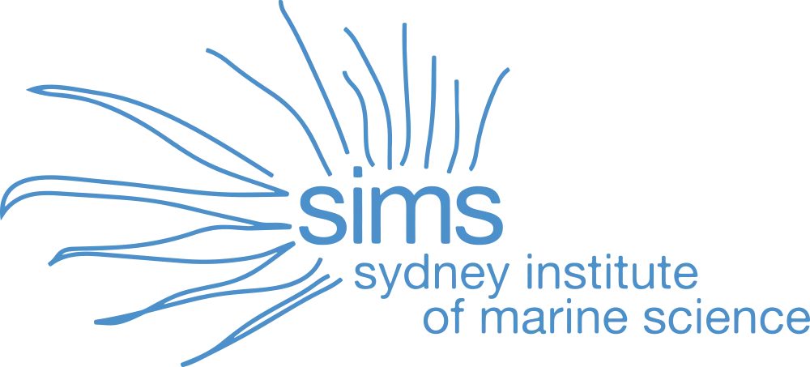
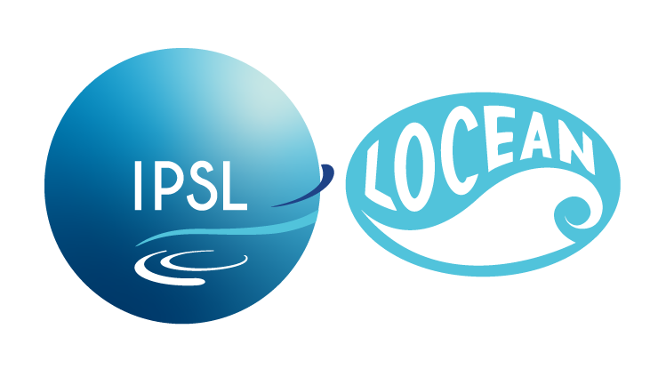
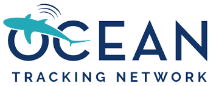

<!-- README.md is generated from README.Rmd. Please edit that file -->

# {ArgosQC} <a href='https://ianjonsen.github.io/ArgosQC/index.html'></a>

<!-- badges: start -->

<!-- badges: end -->

An R package to conduct unsupervised location quality-control of
IMOS-deployed SMRU SRDL-CTD tag data in near real-time. {ArgosQC}
automatically does the following:

1.  accesses SMRU or WC tag data from a local file source or from
    manufacturer’s Data portal
2.  organizes the multi-file data structures
3.  organizes associated deployment metadata
4.  collates the tag data with deployment metadata
5.  fits SSM’s to species-specific subsets of the data
6.  appends SSM-estimated locations to every tag-measured event record
    (CTD, dive, haulout, raw Argos location, raw GPS location, etc)
7.  writes appended tag files to .csv in a user-specified output
    directory

The SMRU SRDL-CTD tag QC process is detailed in the IMOS [Best Practice
Manual](https://repository.oceanbestpractices.org/handle/11329/2571).
The Wildlife Computers tag QC process follows an analogous workflow that
accommodates the manufacturer’s tag data file structures.

## Installation

You can install the main version of ArgosQC from
[GitHub](https://github.com/) with:

``` r
# install.packages("pak")
pak::pak("ianjonsen/ArgosQC")
```

## Example

ArgosQC workflows can be run via single functions, specific to the
AniBOS Program (ATN, IMOS, etc…) and the tag manufacturer - currently,
SMRU (`smru`) or Wildlife Computers (`wc`):

``` r
library(ArgosQC)

smru_qc(wd = "test", config = "test_conf.json")
```

# Acknowledgements:

### Financial support for the development of this software is provided by:

#### [](https://imos.org.au) [](https://sims.org.au)

via Rob Harcourt & Clive McMahon

#### [](https://www.locean.ipsl.fr)

via Laurent MORTIER & Jean-Benoît CHARRASSIN

#### [](https://www.armines.net/fr)

via Laurent MORTIER

#### [](https://oceantrackingnetwork.org)

via Evelien VanderKloet & Jon Pye
