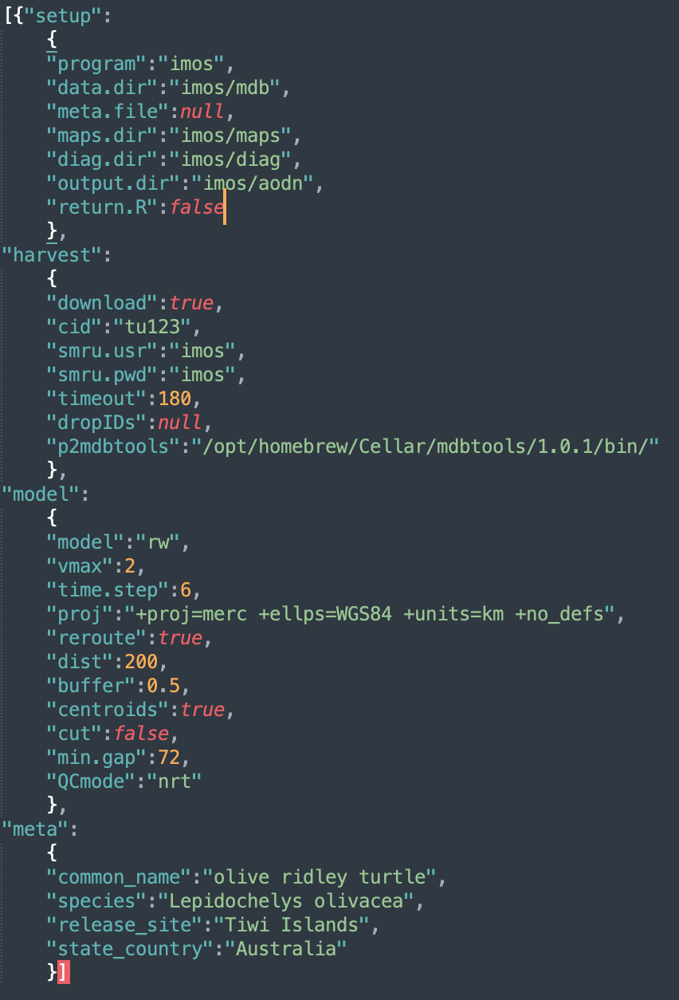

```{r, include = FALSE}
knitr::opts_chunk$set(
  collapse = TRUE,
  comment = "#>"
)
```

## SMRU SRDL-CTD tag QC workflow

The first step to initiate any `ArgosQC` workflow is to construct a `JSON`
config file. The file is hierarchical in structure with as many as 4
blocks: `setup`, `harvest`, `model`, and `meta`. The `meta` block is
only required if no metadata file is provided in the `setup` block.
These files can be constructed manually or programmatically and provide
the ability to define certain aspects of the QC workflow. Below is the
config file for an IMOS QC workflow on SMRU GPS SRDL-CTD tags deployed
on olive ridley turtles on the Tiwi Islands, Australia. All SMRU tag
data are organised by deployment campaign ids, e.g., `ct188`. A separate
QC workflow (config file) must be generated for each deployment
campaign.

<center>{width="100%"}</center>

The block-specific parameters are as follows:

<ul>

<li>

`setup` config block specifies the program overseeing data assembly &
paths to required data, metadata & output directories:

<ul>

<li>

`program` the national (or other) program of which the data is a part.
Current options are: `imos`, `atn`, or `otn`.

<li>

`data.dir` the name of the data directory. Must reside within the `wd`.

<li>

`meta.file` the metadata filename. Must reside within the `wd`. Can be
NULL, in which case, the `meta` config block (see below) must be present
& tag-specific metadata are scraped from the SMRU data server.

<li>

`maps.dir` the directory path to write diagnostic maps of QC'd tracks.

<li>

`diag.dir` the directory path to write diagnostic time-series plots of
QC'd lon & lat.

<li>

`output.dir` the directory path to write QC output CSV files. Must
reside within the `wd`.

<li>

`return.R` a logical indicating whether the function should return a
list of QC-generated, internal R objects. This results in a single large
object returned to the R work space containing the following elements:

<ul>

<li>

`cid` the SMRU campaign ID

<li>

`dropIDs` the SMRU Reference ID's dropped from the QC process

<li>

`smru` the SMRU tag data tables extracted from the downloaded .mdb file

<li>

`meta` the working metadata

<li>

`locs_sf` the projected location data to be passed as input to the SSM

<li>

`fit1` the initial SSM output fit object

<li>

`fit2` the final SSM output fit object including re-routed locations if
specified.

<li>

`smru_ssm` the SSM-annotated SMRU tag data tables. This output object
can be useful for troubleshooting undesirable results during
delayed-mode (supervised) QC workflows.\

</ul>

</ul>

</ul>

<ul>

<li>

`harvest` config block specifies data harvesting parameters:

<ul>

<li>

`download` a logical indicating whether tag data are to be downloaded
from the SMRU data server or read from the local `data.dir`.

<li>

`cid` SMRU campaign ID.

<li>

`smru.usr` SMRU data server username as a string.

<li>

`smru.pwd` SMRU data server password as a string.

<li>

`timeout` extends the download timeout period a specified number of
seconds for slower internet connections.

<li>

`dropIDs` the SMRU ref ID's that are to be ignored during the QC
process. Can be NULL.

<li>

`p2mdbtools` (optional) provides the path to the mdbtools library
(required extract data from `.mdb` -Microsoft Access Database files) if
it is installed in a non-standard location (e.g., on Macs when installed
via Homebrew). Can be set to NULL otherwise.\

</ul>

</ul>

</ul>

<ul>

<li>

`model` config block specifies model- and data-specific parameters:

<ul>

<li>

`model` the aniMotum SSM model to be used for the location QC -
typically either `rw` or `crw`.

<li>

`vmax` for SSM fitting; max travel rate (m/s) to identify implausible
locations

<li>

`time.step` the prediction interval (in decimal hours) to be used by the
SSM

<li>

`proj` the proj4string to be used for the location data & for the
SSM-estimated locations. Can be NULL, which will result in one of 5
projections being used, depending on whether the centroid of the
observed latitudes lies in N or S polar regions, temperate or equatorial
regions, or if tracks straddle (or lie close to) -180,180 longitude.

<li>

`reroute` a logical; whether QC'd tracks should be re-routed off of land
(default is FALSE). Note, in some circumstances this can substantially
increase processing time. Default land polygon data are sourced from the
`ropensci/rnaturalearthhires` R package.

<li>

`dist` the distance in km from outside the convex hull of observed
locations from which to select land polygon data for re-routing. Ignored
if `reroute = FALSE`.

<li>

`barrier` an optional filepath to an alternate polygon data file for the
land (or other) barrier. For example, higher resolution local coastline
data can be supplied, provided the data extend at least `dist` km beyond
the extent of the track data.

<li>

`buffer` the distance in km to buffer rerouted locations from the
coastline. Ignored if `reroute = FALSE`.

<li>

`centroids` whether centroids are to be included in the visibility graph
mesh used by the rerouting algorithm. See `?pathroutr::prt_visgraph` for
details. Ignored if `reroute = FALSE`.

<li>

`cut` logical; should predicted locations be dropped if they lie within
in a large data gap (default is FALSE).

<li>

`min.gap` the minimum data gap duration (h) to be used for cutting
predicted locations (default is 72 h)

<li>

`QCmode` one of either `nrt` for Near Real-Time QC or `dm` for Delayed
Mode QC.

</ul>

</ul>

<ul>

<li>

`meta` config block specifies species and deployment location
information. This config block is only necessary when no metadata file
is provided in the `setup` block.

<ul>

<li>

`common_name` the species common name (e.g., "southern elephant seal")

<li>

`species` the species scientific name (e.g., "Mirounga leonina")

<li>

`release_site` the location where tags were deployed (e.g., "Iles
Kerguelen")

<li>

`state_country` the country/territory name (e.g., "French Overseas
Territory")

</ul>

</ul>

With a completed config file, the standard call within R is:

```{r fn call, eval=FALSE}
smru_qc(wd = "test", config = "imos_config.json")
```

where `wd` is the file path for the working directory within which all
QC data/metadata inputs are downloaded (or read) and outputs are
written.

### Additional details on config parameters

The `proj` argument specifies the projection (as a `proj4string`) to
which the tag-measured locations are converted as input to the QC
state-space model (SSM), ie. the working projection in `km` for the SSM.
Any valid `proj4string` may be used, provided the units are in `km`. If
`proj` is left as `NULL` then the QC algorithm will project the data
differently depending on the centroid latitude of the tracks. The
default projections are:

| Central Latitude or Longitude | Projection (with `+units=km`) |
|:-----------------:|:---------------------------------------------------:|
| -55 to -25 or 25 to 55 Lat | Equidistant Conic with standard parallels at the tracks' 25th & 75 percentile Latitudes |
| \< -55 or \> 55 Lat | Stereographic with origin at the tracks' centroid |
| -25 to 25 Lat | Mercator with origin at the tracks' centroid |
| -25 to 25 Lat & Long straddles -180,180 | Longitudes are shifted to 0, 360 and a Mercator with origin at tracks' centroid |

The `model` argument specifies the `aniMotum` SSM to be used; typically
either `rw` or `crw`. The latter is usually less biased when data gaps
are absent, the former is best when data gaps are present. A general
recommendation is to use `model`:`rw` as the SSM for unsupervised (e.g.,
NRT) QC workflows. The SSM fitting algorithm has a few fundamental
parameters that need to be specified; `vmax` is the animals' maximum
plausible travel rate in ms$^{-1}$. For example, `vmax`:`3` is usually
appropriate for seals and `vmax`:`2` for turtles. The SSM prediction
interval in hours is specified with `time.step`. Decimal hours can be
used for `time.steps` shorter than 1 hr. This time interval determines
the temporal resolution of the predicted track. The predicted track
locations provide the basis for interpolation to the time of each
tag-measured ocean observation or behavioural event. Typically, 6 hours
is appropriate for most Argos data collected from seals and turtles but
a finer time interval may be required for faster moving species and/or
more frequently measured ocean observations, and a coarser interval for
more sporadically observed locations. Further details on SSM fitting to
Argos and GPS data are provided in the associated R package [aniMotum
vignettes](https://ianjonsen.github.io/aniMotum/) and in [Jonsen et al.
2023](https://besjournals.onlinelibrary.wiley.com/doi/full/10.1111/2041-210X.14060).

When animals pass close to land some SSM-predicted locations may
implausibly lie on land. Often, this is due to the spatial and temporal
resolution of the Argos tracking data. In these cases, SSM-predicted
locations can be adjusted minimally off of land by setting
`reroute`:`true`. The [`pathroutr` R
package](https://jmlondon.github.io/pathroutr/) is used for efficient
rerouting. In this case, additional arguments should be specified:

`dist` - the distance in km beyond track locations from which coastline
polygon data should be sampled (smaller provides less information for
path re-routing, greater increase computation time)

`buffer` - the distance in km to buffer rerouted locations from the
coastline

`centroid`- whether to include the visibility graph centroids for
greater resolution

SSM-predicted tracks can be `cut` (`cut`:`true`) in regions where large
location data gaps exist. These location data gaps can occur when the
tags are unable to transmit for extended periods or when animal
surfacing occurs during periods of Argos satellite unavailability (more
common closer to the equator than at higher latitudes). In this case,
`min.gap` is used to specify the minimum data gap duration (h) from
which to cut SSM-predicted locations. This will limit interpolation
artefacts due to implausible SSM-predicted locations in excessively long
data gap periods.

The `QCmode` sets whether the QC is being conducted in delayed-mode `dm`
or near real-time `nrt`. Delayed-mode is reserved for when tag
deployments have ended and usually involve greater user intervention;
such as making decisions on removing aberrant portions of a deployment
(e.g., as tag batteries begin failing). The `nrt` mode is mean to be
fully automated and only used while a deployment is active. In both
cases, the output .CSV and plot file names will include the `QCmode` as
a suffix.

In the above example, the main QC outputs were written to files. The QC
output .CSV files were written to the specified output directory. Each
.CSV file includes the name of the SMRU data table, when present (ctd,
diag, dive, haulout, summary) or the QC file (metadata, ssmoutputs). For
QC workflows of ATN data, each of these file names is appended with the
species' AnimalAphiaID and the ADRProjectID. For IMOS and other program
data, the file names are appended with the SMRU campaign ID.

The diag files show the SSM fit (red) overlaid on the tag-measured Argos
&/or GPS locations (blue). The dark grey vertical bars denote the time
period tags were actively recording locations but the seal(s) had not
yet gone to sea (no recorded diving activity). By default, the QC model
does not fit to data in these time periods. These plots help judge
whether the SSM fits have artefacts that need addressing - typically
only addressed during a delayed-mode QC workflow.
{width="100%"}

The map file shows the SSM-predicted tracks (blue) and current last
estimated location (red) for each deployed tag. The map files are
annotated by the QC date so they are not overwritten by successive QC
runs. {width="100%"}

#### Output .CSV files

The QC's main outputs, the .CSV files contain all records from the
original SMRU data tables and are appended with the following additional
columns: `ssm_lat`, `ssm_lon`, `ssm_x`, `ssm_y`, `ssm_x_se`, `ssm_y_se`.
These are the QC'd locations and their uncertainty estimates
interpolated to the time of each record. The `ssm_x`, `ssm_y` variables
are the coordinates from the QC workflow projection (in km) and
`ssm_x_se`, `ssm_y_se` are the associated standard errors (in km). Note
that NA's may be present in the QC-appended location variables,
particularly at the start and/or end of individual tracks. This is
typically indicative of track portions prior to animals going to sea (at
deployment start) and portions when either the CTD or pressure sensor
failed, eg. due to biofouling or seawater ingress, but tag still
transmitted locations (near deployment end).

#### Metadata .CSV file

If an input deployment/tag metadata file is provided then the output
metadata file contains all the original metadata records plus the
following variables describing the QC workflow applied to the data:

-   `QCStartDateTime` - the track datetime (UTC) at which the QC
    workflow was started.
-   `QCStopDateTime` - the track datetime (UTC) at which the QC workflow
    was ended.
-   `QCproj4string` - the projection used for QC'ing the locations, as a
    proj4string.
-   `QCMethod` - denotes the `ArgosQC` R package was used.
-   `QCVersion` - denotes the version number of the `ArgosQC` R package
    used.
-   `QCDateTime` - the datetime (UTC) when the QC was applied to the
    data.

Note, these variables are not appended to the metadata for IMOS QC
workflows due to IMOS - AODN metadata specifications.

#### SSMOutputs .CSV file

The SSMOutputs file contains the SSM-predicted locations at the
`time.step` specified prediction interval. The time of the first
location is set to the time of the first tag-measured location passed to
the model. This may or may not be the first tag-measured location in the
tag datafile, depending on whether the animal-borne tag was immediately
at sea. The location coordinates are provided as: `lon`, `lat`, `x`,
`y`, and location uncertainty as `x_se`, `y_se`. The planar coordinates
and uncertainty estimates always have units in km. Their coordinate
projection is provided in the metadata .CSV file (`QCproj4string`).
