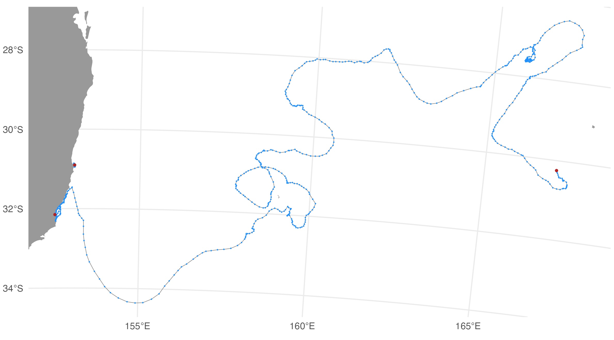

```{r, include = FALSE}
knitr::opts_chunk$set(
  collapse = TRUE,
  comment = "#>"
)
```

## Wildlife Computers (WC) tag QC workflow

The first step to initiate any `ArgosQC` workflow is to construct a `JSON`
config file (see [WC_config_file](WC_config_file.html)). 

The diag files show the SSM fit (red) overlaid on the tag-measured Argos
&/or GPS locations (blue). The dark grey vertical bars denote the time
period tags were actively recording locations but the seal(s) had not
yet gone to sea (no recorded diving activity). By default, the QC model
does not fit to data in these time periods. These plots help judge
whether the SSM fits have artefacts that need addressing - typically
only addressed during a delayed-mode QC workflow.

{width="60%"}

The map file shows the SSM-predicted tracks (blue) and current last
estimated location (red) for each deployed tag. The map files are
annotated by the QC date so they are not overwritten by successive QC
runs. 
{width="100%"}


#### Output .CSV files

The QC's main outputs are the Wildlife Computers tag data files appended
with the same QC'd location variables as the SMRU tag QC output files:
`ssm_lat`, `ssm_lon`, `ssm_x`, `ssm_y`, `ssm_x_se`, `ssm_y_se`. The
output .CSV files necessarily depend on the specific type of Wildlife
Computers tag(s) that is/are being QC'd. Currently, the `ArgosQC`
workflow accommodates SPOT, SPLASH and SCOUT tag data. Combined across
these tag types, the following output .CSV files (per Wildlife
Computers) are provided:

-   `DSA`
-   `ECDHistos`
-   `FastGPS`
-   `Histos`
-   `Locations`
-   `MinMaxDepth`
-   `MixLayer`
-   `PDTs`
-   `SST`

Where one of these files can have a data structure that differs between
specific tag types, the file names are appended with the tag type. For
example, the `ECDHistos` file structure differs between SCOUT DSA and SCOUT
TEMP 361A tags, so these file names appear as either
`ECDHistos_SCOUT_DSA` or `ECDHistos_SCOUT_TEMP_361A`. Similar scenarios
for other tag types/versions will be incorporated as required in future
versions of `ArgosQC`.

In the generic metadata case, ie. for all programs other than ATN, each of the 
WC QC output file names are appended with the species' common name and the 
`QCmode` suffix - `_nrt` or `_dm`. For ATN data and metadata, each file is 
appended with the AnimalAphiaID, the ATN ADRProjectID and the `QCmode` suffix -
`_nrt` or `_dm`. 

#### Metadata .CSV file

If an input deployment metadata file is provided then the output
metadata file contains all the original metadata records plus the
following variables describing the QC workflow applied to the data:

-   `qc_start_date` - the track datetime (UTC) at which the QC
    workflow was started.
-   `qc_end_date` - the track datetime (UTC) at which the QC workflow
    was ended.
-   `qc_proj4string` - the projection used for QC'ing the locations, as a
    proj4string.
-   `qc_method` - denotes the `ArgosQC` R package was used.
-   `qc_version` - denotes the version number of the `ArgosQC` R package
    used.
-   `qc_run_date` - the datetime (UTC) when the QC was applied to the
    data.

#### ssmoutputs .CSV file

The ssmoutputs file contains the SSM-predicted locations at the
`pred.int` specified prediction interval. The time of the first
location is set to the time of the first tag-measured location passed to
the model. This may or may not be the first tag-measured location in the
tag locations data file, depending on whether the animal-borne tag was 
immediately at sea. The location coordinates are provided as: `lon`, `lat`, `x`,
`y`, and location uncertainty as `x_se`, `y_se`. The planar coordinates
and uncertainty estimates always have units in km. Their coordinate
projection is provided in the metadata .CSV file (`qc_proj4string`).
