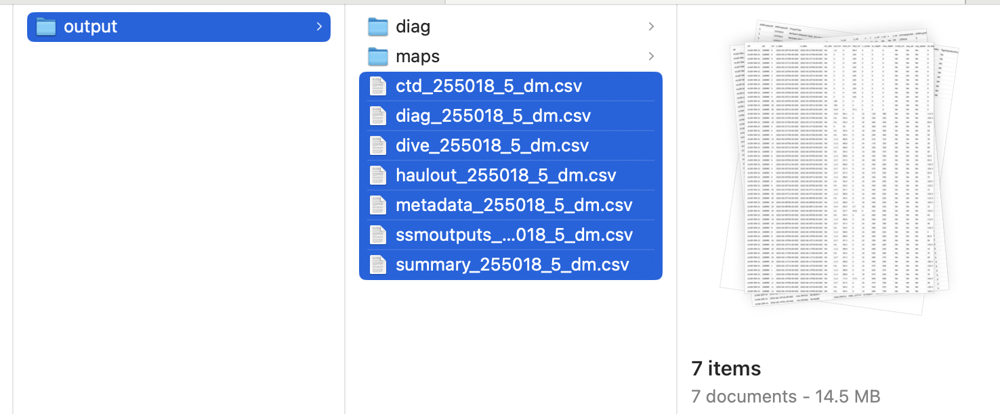
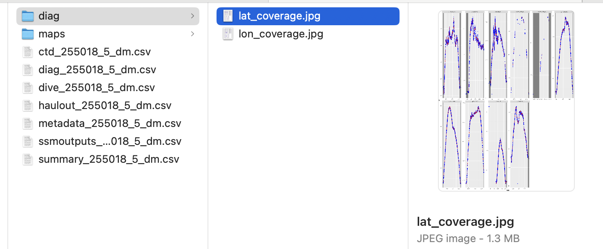
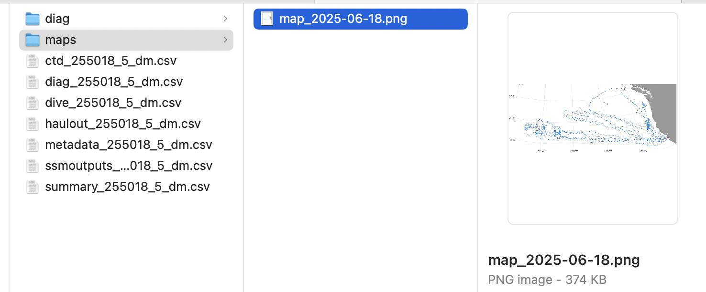
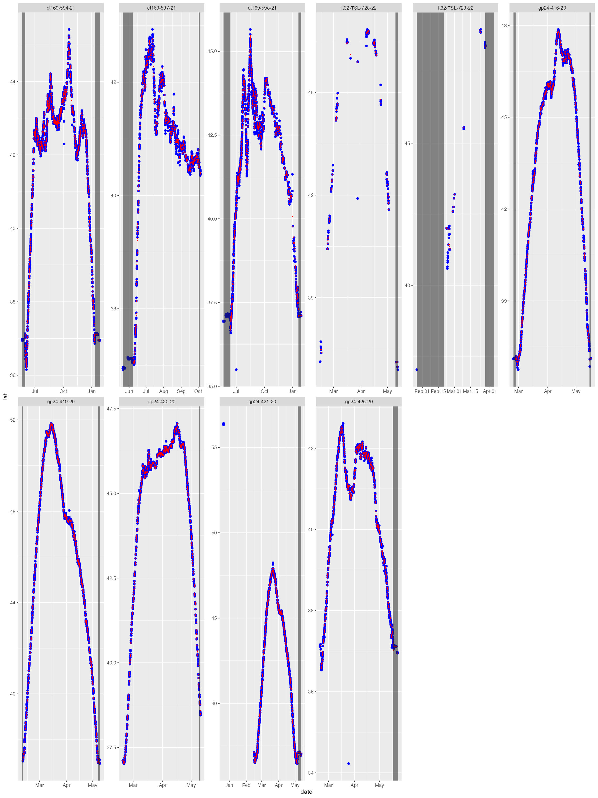
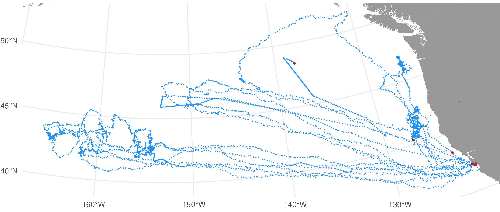

```{r, include = FALSE}
knitr::opts_chunk$set(
  collapse = TRUE,
  comment = "#>"
)
```

```{r setup}
library(ArgosQC)
```

## Background
`ArgosQC` provides automated workflows for quality controlling Argos & GPS (when present) locations obtained from either SMRU SRDL or Wildlife Computers animal telemetry tags. Workflows currently are set up for IMOS and ATN tagging data. The general workflow for SMRU tags is documented in [Jonsen et al. 2024](https://repository.oceanbestpractices.org/handle/11329/2571). The workflow for Wildlife Computers tags is analogous, with differences due to the various tag data structures.

## Workflows
Several automated QC workflows have been set up for SMRU SRDL-CTD (and related) tags, and for Wildlife Computers SPOT, SPLASH and SCOUT tags. The workflows are specific to IMOS - AODN and ATN metadata and QC output data structure requirements. The following QC workflows can be implement from a single `ArgosQC` function, with output written to .CSV files in a user-specified directory:

|             Workflow                                   |    Function         |
|:------------------------------------------------------:|:-------------------:|
| IMOS - AODN SMRU SRDL-CTD (and related) tags           |  `imos_smru_qc()`   |
| ATN SMRU SRDL-CTD (and related) tags                   |  `atn_smru_qc()`    |
| ATN Wildlife Computers SPOT, SPLASH, and SCOUT tags    |  `atn_wc_qc()`      |

These single function workflows simplify the automated QC implementation. Additional workflows will be added as required to accommodate additional tag manufacturers and/or tag data structures, as well as organisational metadata and output data formatting requirements. The QC workflows can also be implemented by calling individual `ArgosQC` functions in series as required. This latter approach allows greater flexibility as intermediate & final output data and metadata can be re-structured as needed. Both approaches are highlighted in examples below.

## Examples

### 1. ATN SMRU SRDL-CTD tag workflow
```{r fn call, eval=FALSE}
out <- atn_smru_qc(wd = "test",
            datadir = "tagdata",
            meta.file = "metadata/metadata.csv",
            outdir = "smru/output",
            proj = NULL,
            model = "rw",
            vmax = 3,
            time.step = 6,
            reroute = FALSE,
            cut = FALSE,
            QCmode = "dm",
            output = TRUE)
```

The first 4 arguments provide the file paths for the working directory `wd`, the tag data directory `datadir`, the metadata file path `meta.file`, and the QC output directory `outdir`. The paths provided can have arbitrary names but the assumption is that all paths lie within the outer working directory `wd`. `atn_smru_qc()` will also generate two additional directories: `maps` and `diag`, inside the `output` directory, for a map of all QC'd tracks and diagnostic plots of the state-space model (SSM) fits to the tag-measured locations. These plots display the SSM-estimated longitudes overlaid on the tag-measured longitudes, and similarly for latitude.

The `proj` argument specifies the projection (as a `proj4string`) to be used for the tag-measured long,lat data, ie. the working projection in `km` for the SSM. Any valid `proj4string` may be used, provided the units are in `km`. If `proj` is left as `NULL` then the QC algorithm will project the data differently depending on the centroid latitude of the tracks. The default projections are:

|         Central Latitude or Longitude       |                           Projection (with `+units=km`)                                                        |
|:------------------------------:|:-------------------------------------------------------------------------------------------:|
|     -55 to -25 or 25 to 55 Lat |  Equidistant Conic with standard parallels at the tracks' 25th & 75 percentile Latitudes    |
|     < -55 or > 55 Lat  |   Stereographic with origin at the tracks' centroid         |
|     -25 to 25 Lat             |            Mercator with origin at the tracks' centroid              |
|    -25 to 25 Lat & Long straddles -180,180      |   Longitudes are shifted to 0, 360 and a Mercator with origin at tracks' centroid   |


The `model` argument specifies the `aniMotum` SSM to be used; typically either `rw` or `crw`. The latter is usually less biased when data gaps are absent, the former is best when data gaps are present. The SSM fitting algorithm has a few fundamental parameters that need to be specified; `vmax` is the animals' maximum plausible travel rate in ms$^{-1}$. For example, `vmax=3` is usually appropriate for seals and `vmax=2` for turtles. The SSM prediction interval in hours is specified with `time.step`. This time interval determines the temporal resolution of the predicted track. The predicted track locations provide the basis for interpolation to the time of each tag-measured ocean observation or behavioural event. Typically, 6 hours is appropriate for most Argos data collected from seals and turtles but a finer time interval may be required for faster moving species and/or more frequently measured ocean observations, and a coarser interval for more sporadically observed locations. Further details on SSM fitting to Argos and GPS data are provided in the associated R package [aniMotum vignettes](https://ianjonsen.github.io/aniMotum/) and in [Jonsen et al. 2023](https://besjournals.onlinelibrary.wiley.com/doi/full/10.1111/2041-210X.14060).

When animals pass close to land some SSM-predicted locations may implausibly lie on land. Often, this is due to the spatial and temporal resolution of the Argos tracking data. In these cases, SSM-predicted locations can be adjusted minimally off of land by setting `reroute = TRUE` (the default is FALSE). The [`pathroutr` R package](https://jmlondon.github.io/pathroutr/) is used for efficient rerouting. In this case, additional arguments may be specified:

`dist` - the distance in km beyond track locations from which coastline polygon data should be sampled (smaller provides less information for path re-routing, greater increase computation time)

`buffer` - the distance in km to buffer rerouted locations from the coastline

`centroid`- whether to include the visibility graph centroids for greater resolution

SSM-predicted tracks can be `cut` (`cut = TRUE`) in regions where large location data gaps exist. These location data gaps can occur when the tags are unable to transmit for extended periods or when animal surfacing occurs during periods of Argos satellite unavailability (more common closer to the equator than at higher latitudes). In this case, `min.gap` is used to specify the minimum data gap duration (h) from which to cut SSM-predicted locations. This will limit interpolation artefacts due to implausible SSM-predicted locations in excessively long data gap periods. 

The `QCmode` sets whether the QC is being conducted in delayed-mode `dm` or near real-time `nrt`. Delayed-mode is reserved for when tag deployments have ended and usually involve greater user intervention; such as making decisions on removing aberrant portions of a deployment (e.g., as tag batteries begin failing). The `nrt` mode is mean to be fully automated and only used while a deployment is active. In both cases, the output .CSV and plot filenames will include the `QCmode` as a suffix.

The `output = TRUE` argument (the default is `output = FALSE`) can be used to return all workflow-generated R objects in a single, named list. As in the above example code. This can be useful for troubleshooting errors and provides a starting point for examining the QC output during a supervised, delay-mode QC workflow.


In the above example, the main QC outputs were written to files and all intermediate objects were returned as a list in `out`. The QC output .CSV files were written to the specified output directory. Each .CSV file includes the name of the SMRU data table, when present (ctd, diag, dive, haulout, summary) or the QC file (metadata, ssmoutputs). Each of these files. For ATN QC workflows, each of these filenames is appended with the species' AnimallAphiaID and the ATN ADRProjectID.
{width=95%}

The map & diagnostic plots were written to their respective `diag` and `maps` directories:
{width=95%}
{width=95%}

The diag files show the SSM fit (red) overlaid on the tag-measured Argos &/or GPS locations (blue). The dark grey vertical bars denote the time period tags were actively recording locations but the seal(s) had not yet gone to sea (no recorded diving activity). By default, the QC model does not fit to data in these time periods. These plots help judge whether the SSM fits have artefacts that need addressing - typically only addressed during a delayed-mode QC workflow.
{width=75%}

The map file shows the SSM-predicted tracks (blue) and current last estimated location (red) for each deployed tag. The map files are annotated by the QC date so they are not overwritten by successive QC runs. 
{width=95%}

#### Output .CSV files

The QC's main output, the .CSV files contain all records from the original SMRU data tables and are appended with the following additional columns: `ssm_lat`, `ssm_lon`, `ssm_x`, `ssm_y`, `ssm_x_se`, `ssm_y_se`. These are the QC'd locations and their uncertainty estimates interpolated to the time of each record. The `ssm_x`, `ssm_y` variables are the coordinates from the QC workflow projection (in km) and `ssm_x_se`, `ssm_y_se` are the associated standard errors (in km). 

#### Metadata .CSV file
The metadata file contains all the original ATN metadata records plus the following additions describing the QC workflow applied to the data:
- `QCStartDateTime` - the track datetime (UTC) at which the QC workflow was started.
- `QCStopDateTime` - the track datetime (UTC) at which the QC workflow was ended.
- `QCMethod` - denotes the `ArgosQC` R package was used.
- `QCVersion` - denotes the version number of the `ArgosQC` R package used.
- `QCDateTime` - the datetime (UTC) when the QC was applied to the data.

#### SSMOutputs .CSV file
